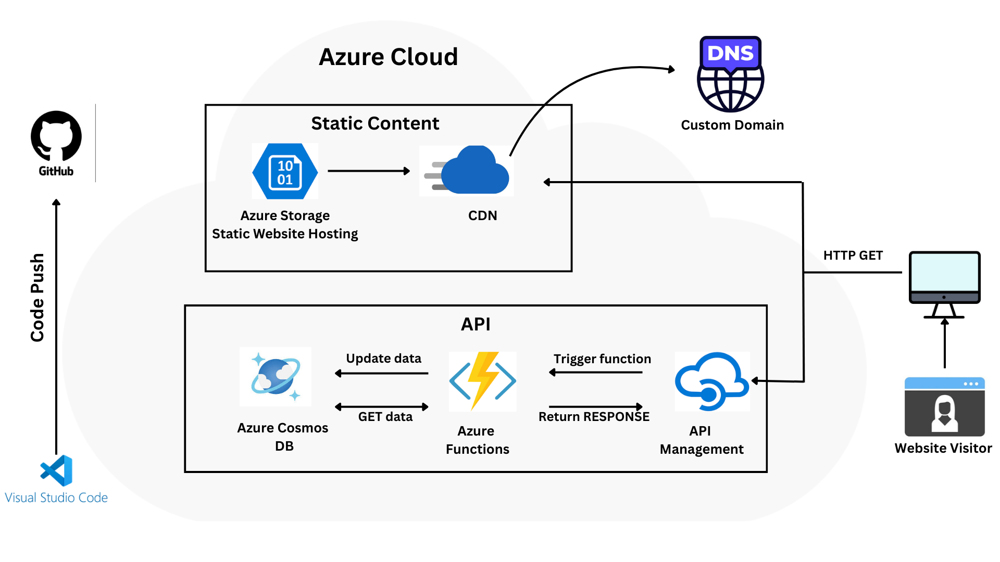

# Introduction

Hi there!
I'm a stay-at-home mom with a growing passion for technology and cloud computing. As someone who's always eager to learn and challenge myself, I decided to dive into the world of Azure and start building hands-on experience.
To kick off my cloud journey, I took on the Azure Resume Challenge — a fun and technical project that let me put my skills to work by deploying a serverless, cloud-hosted resume site using Azure services like Functions, Cosmos DB, and more.
I’ve recently completed the AZ-900, AZ-104 certifications as well as the FinOps Practitioner certification, and I’m excited to continue learning, growing, and contributing to the tech community.
This project is a reflection of my commitment to transitioning into a cloud-focused role and continuously challenging myself to grow in this field.

## Demo
My resume's website is [here](https://www.cloudchallangezsofiasresume.com). 
If you're reading this in the future and the link doesn't work, I probably let the domain expire.

## Structure
- frontend/: Contains the website.
  - main.js: Contains visitor counter code.
- backend/api/: Contains the .NET API deployed on Azure Functions.
  - GetVisitorCounter.cs: Contains the visitor counter code.
- .github/workflows/: Contains CI/CD workflow configurations.

## Architecture layout

## Frontend Resources

The front-end of the site is built as a static webpage using HTML, CSS, and JavaScript. It features a visitor counter that retrieves data through an API call to an Azure Function. I based the design of my site on this template.

## Backend Resources
The back-end consists of an HTTP-triggered Azure Function with Cosmos DB input and output bindings. The function fetches an item from Cosmos DB, increments its value, saves the updated item, and then returns the new value to the caller.

## Testing Resources
Testing is essential, and while my tests are basic, they are present. Although I’m using .NET for this project, many of these resources can be applied to any programming language.

## CI/CD Resources
Whenever changes are made to the backend directory, the CI/CD workflow is triggered and executed. The backend job will deploy updated functions, such as Azure functions, to the cloud with the changes I made. Meanwhile, the frontend pipeline handles deploying the frontend to Azure whenever there are changes to it as well.

## Steps
- [x] Create a GitHub repo.
- [x] Use HTML and CSS to build the website and store the code in the repo.
- [x] Add a visitor count to the website using Azure Functions with HTTP trigger, Azure   Cosmos DB.
- [x] Deploy the website to Azure Blob Storage.
- [x] Purchase a custom domain and delegate DNS management to Azure.
- [x] Setup Azure CDN, map custom domain to the CDN endpoint and enable HTTPS routing.
- [x] Unit Testing using .NET8
- [x] Pipeline Configuration and Set up GitHub Actions 

## About the challenge

- The first phase involved creating a static resume website using HTML and CSS. I followed along the [ACG Project video of A Cloud Guru](https://www.youtube.com/watch?v=ieYrBWmkfno&t=4809s). To save time on design, I used Gwyn’s template and I customized the code to match my desired layout. Afterward, I added all the essential details to complete the resume page.

- I used GoDaddy for my domain purchase. Creating the Azure CDN was quite simple, and attaching my custom domain to it was equally easy.

- Integrating the Frontend and Backend: This part was a bit challenging for me, especially since I’m not the most experienced programmer. However, once I figured it out and saw the visitor counter updating correctly on the page, it was incredibly satisfying! (Just remember to purge the CDN after making changes to your website!)

## What was the hardest part?
The most challenging aspect of the challenge for me was getting the function to work. I faced several obstacles, primarily because it was my first time working with Azure Functions and serverless computing in a real-world scenario. Gwyn’s video was outdated, and I had difficulty finding the correct Azure Cosmos DB bindings. I had to read a lot about APIs, Azure Cosmos DB triggers & bindings, and NoSQL databases to fully understand what I needed to do.However, after many hours of frustrating debugging, I finally succeeded.

## Conclusion
Looking back, I’m really grateful I took on the Cloud Resume Challenge. It gave me a much deeper understanding of core cloud concepts in a way that studying alone couldn’t. Certifications are valuable, but there’s nothing quite like building something from scratch, hitting roadblocks, and digging into the documentation to solve real problems. That hands-on experience is truly where the learning happens!

  

